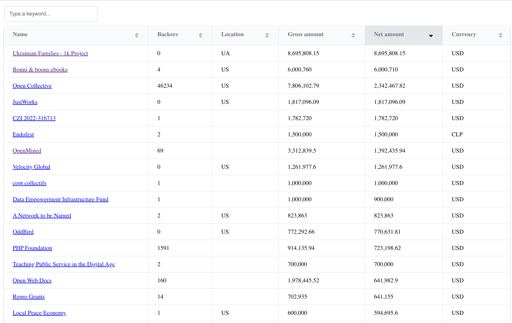

# Opencollective scrapper

Scrapper allows to download search results from the opencollective.com

## 1. Installation
Node required. No dependencies to install

## 2. Scrap data
Run `node index.js` and wait.
At the end `accounts YYYY-MM-DD.json` is created

If scrap process fails, edit offset in the index.js and run again. Process will continue from that point.

## 3. Visualize data
Run index.html and drag & drop `accounts YYYY-MM-DD.json` file.

Preview

